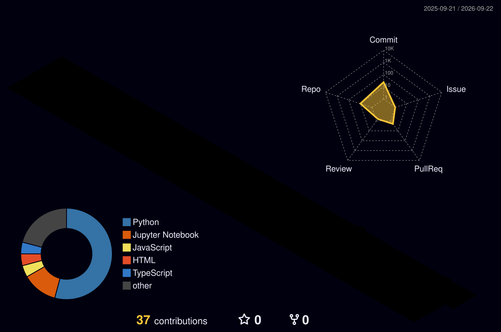

# Hi, I'm Lakshay 👋

MS Computer Science @ USC · AI Research Engineer · Los Angeles, CA

<!--
  Fill in before committing:
  - GitHub username (lakshaym7 is a guess from your fall-detection paper link)
  - LinkedIn handle
  - The [Repo] links in Projects
  - Add the 3D-calendar workflow file (profile-3d.yml) so the contribution graphic renders
-->

---

## About Me

I build multimodal GenAI systems and vision-language pipelines, with most of my work sitting where **machine learning meets healthcare**. My research runs from agentic RAG workflows to medical image understanding, and I care most about the parts that make a model actually usable, meaning scoped changes, honest evaluation suites, and pipelines that hold up under real load.

🔭 Currently building a **multimodal framework for pancreatic cancer prognosis** and researching multi-agent decision systems.

🏆 **Best Paper Award**, IEEE ICDSBS 2025 · Published book chapter · Open-source contributor to **HippoRAG** and **Apache Cassandra**.

---

## Technical Skills

**Languages**

**AI & ML**

**Data & Databases**

**Backend & Infra**

**AI Tooling**

---

## Featured Projects

### 🏥 Agentic AI Pipeline for Healthcare Claims Review
Insurance claims review is slow, and a single wrong denial can cost a patient real money, so I set out to automate that review against payer policy without ever letting a model make an unchecked high-stakes call. I built a backend of four coordinated agents that run retrieval-augmented generation over policy documents, then wrapped the entire decision path in deterministic human-in-the-loop guardrails that catch any output produced below 70% confidence or flagged for a billing-code conflict. The system reached 100% top-1 policy retrieval accuracy, correctly overrode an incorrect 82%-confidence denial and escalated it to a human, and cleared a 46-test suite spanning guardrails, retrieval quality, knowledge-grounded reasoning, and end-to-end correctness.
 *Python · RAG · Multi-Agent Systems · FastAPI* · [Repo](#)

### ⚛️ QMuTrf, Multimodal Transformer for Radiology Reporting &nbsp;`manuscript under review`
Radiologists lose hours turning chest X-rays into written reports, and most automated captioners spit out generic text that glosses over the subtle findings that matter. I wanted a model that reads an X-ray and drafts a clinically faithful report. I fine-tuned three vision transformers (ViT, DEiT, BEiT) with variational quantum circuits and wired them to a GPT-2 decoder through cross-attention, then ran a full ablation across qubit counts and circuit depth to find what genuinely moved the metrics rather than what looked good on paper. The strongest configuration reached a ROUGE-L of 0.614 on the Indiana University Chest X-ray dataset and produced the most diagnostically complete captions of any variant, flagging findings like mild degenerative spine changes that the baselines skipped.
 *PyTorch · PennyLane · Vision Transformers · GPT-2* · [Repo](#)

### 🧬 Multimodal DL Framework for Pancreatic Cancer Prognosis &nbsp;`in progress`
Predicting pancreatic cancer outcomes from a single data type is unreliable, and clinicians rarely get any signal for how much to trust a given prediction, so this ongoing project takes on both problems at once. I am building a fusion framework that combines CT imaging with genomic, proteomic, and clinical data, paired with a confidence score that stays independent of the usual prognostic factors. Early results already explain 86.9% of cross-modal disagreement and surface tumor heterogeneity that standard clinical features miss, while the confidence measure holds up as statistically independent of established markers.
 *PyTorch · Multimodal Fusion · Medical Imaging*

### 🤖 SimVLA, Vision-Language-Action for Robotics
Teaching a robot to follow a plain instruction like "pick up the red block" usually means brittle, hand-coded logic for every new command. SimVLA throws that out. I built a single vision-language-action model that takes a natural-language instruction alongside a visual observation and outputs robot actions directly, conditioning manipulation on language from end to end. The payoff is a system that grounds instructions in what the robot actually sees, with no task-specific engineering per command.
 *Python · PyTorch · Robotics* · [Repo](#)

---

## Publications

- **Real-Time Fall Detection Using ARIMA** &nbsp;`Best Paper, IEEE ICDSBS 2025`
   A multi-camera, multi-person fall detection system pairing OpenPifPaf pose estimation with ARIMA time-series forecasting for real-time anomaly detection.
   

- **Enhancing Solar Cell Defect Detection through a Generalized Hybrid Transfer Learning Model** &nbsp;`Book Chapter`
   A hybrid CNN and classical ML approach with LDA dimensionality reduction, reaching 97.41% accuracy on the ELPV electroluminescence dataset.
   

---

## Open Source

- **HippoRAG** (OSU NLP Group) &nbsp;
   Built a pluggable storage abstraction for interchangeable vector backends with full backward compatibility, resolved cross-platform issues across a four-layer import chain that cut peak memory by 33%, and added a 36-test integration suite. Reviewed and landed in main within seven days.

- **Apache Cassandra** &nbsp;
   Contributing to Cassandra's tooling through the project's ticket and code-review workflow, with a patch currently in review.

---

## Experience

### 🧠 AI Research Engineer, USC Institute for Creative Technologies &nbsp;`Nov 2025 to May 2026`
Handed the open-ended problem of getting AI agents to make sharper decisions in simulated environments, I designed LLM-driven agentic pipelines and rebuilt the experimentation loop around them. That work drove a 70% jump in decision-policy performance, pushed multi-agent workflows to a 63%+ win rate across diverse environments, and produced evaluation infrastructure that reproducibly ran more than 960 simulations.

### 💡 AI Student Intern, CodSoft &nbsp;`Jun 2024 to Jul 2024`
I inherited a parsing system that was quietly bleeding accuracy on user-facing responses, so I rebuilt it with automated validation and full test coverage and lifted response accuracy by 31%. From there I shipped REST API services that cut response latency by 22%, then profiled the backend end to end and trimmed pipeline execution time by 35%.

---

## 📊 GitHub Stats

<!-- 3D contribution calendar. Renders after you add profile-3d.yml and it runs once. -->

---

## 🎓 Education

- **MS in Computer Science**, University of Southern California &nbsp;`2025 to 2027`
- **BTech in Computer Science and Engineering**, Vellore Institute of Technology, Chennai &nbsp;`2021 to 2025`

 
<i>Open to research collaborations and roles in ML engineering, applied AI, and healthcare AI.</i>

